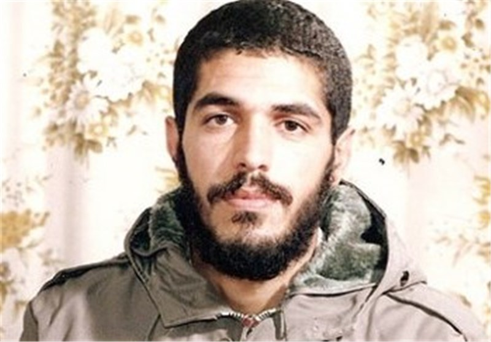

+++
author = "Solaha Authors"
title = "ابراهیم هادی"
date = "2023-07-17T18:29:34+03:30"
description = "شهید ابراهیم هادی"
images = [
    "images/ibrahim-hadi.jpg"
]
tags = [
    "شهدا",
    "هشت سال دفاع مقدس",
]
categories = [
    "شهدا",
    "هشت سال دفاع مقدس",
]
aliases = [""]
+++

پهلوان بسیجی ابراهیم هادی از بنیانگذاران گروه چریکی شهید اندرزگو در جبهه گیلانغرب و ستاره ورزش کشتی کشورمان است؛ او در اول اردیبهشت سال ۱۳۳۶ در محله شهید سعیدی حوالی میدان خراسان به دنیا آمد؛ ابراهیم چهارمین فرزند خانواده بود؛ او در نوجوانی طعم تلخ یتیمی را چشید، از آنجا بود که همچون مردان بزرگ زندگی را پیش برد.

ابراهیم دوران دبستان را به مدرسه طالقانی رفت و دبیرستان را نیز در مدارس ابوریحان و کریم‌خان گذراند. او در سال ۵۵ توانست به دریافت دیپلم ادبی نائل شود. از همان سال‌های پایانی دبیرستان، مطالعات غیر درسی را نیز شروع کرد؛ حضور در هیئت جوانان وحدت اسلامی و همراهی و شاگردی استادی نظیر مرحوم علامه «محمدتقی جعفری» بسیار در رشد شخصیتی ابراهیم مؤثر بود.
این شهید مفقود، در دوران پیروزی انقلاب شجاعت‌های بسیاری از خود نشان داد؛ همزمان با تحصیل علم به کار در بازار تهران مشغول بود و پس از انقلاب در سازمان تربیت بدنی و بعد از آن به آموزش پرورش منتقل شد.

یکی از کارهای ابراهیم انتقال مجروحان و شهدا از منطقه به عقب جبهه بود. گاهی اوقات پیکرهای مطهر شهدا در ارتفاعات بازی‌دراز بر شانه‌های ابراهیم می‌نشست تا به دست خانواده‌هایشان برسد.

**خاطراتی از ابراهیم؛

*عصر یک روز وقتی خواهر وشوهر خواهر ابراهیم به منزلشان آمده بودند هنوز دقایقی نگذ شته بود که از داخل کوچه سرو صدایی شنیده می شد.ابراهیم سریع از پنجره طبقه ی دوم نگاه کرد و دید شخصی موتور شوهر خواهرشان را برداشته و در حال فرار است.

ابراهیم سریع به سمت درب خانه آمد و دنبال دزد دوید و هنوز چند قدمی نرفته بود که یکی از بچه محل ها لگدی به موتور زد و آقا دزده با موتور به زمین خورد.تکه آهنی که روی زمین بود دست دزد را برید و خون هم جاری شد. ابراهیم به محض رسیدن نگاهی به چهره پراز ترس و دلهره دزد انداخت و بعد موتور را بلند کرد و گفت: سوار شو! همان لحظه دزد را به درمانگاه برد و دست دزد را پانسمان کرد.

کارهای ابراهیم خیلی عجیب بود و شب هم با هم به مسجد رفتند و بعد از نماز ابراهیم کلی با اون دزد صحبت کرد و فهمید که آدم بیچاره ای است و از زور بیکاری از شهرستان به تهران آمده و دزدی کرده.

ابراهیم با چند تا از رفقا و نمازگزاران صحبت کرد و یه شغل مناسبی برای آن آقا فراهم کرد.مقداری هم پول از خودش به آن شخص داد و شب هم شام خورد و استراحت کردند.صبح فردا خیلی از بچه ها به این کار ابراهیم اعتراض کردند. ابراهیم هم جواب داده بود:مطمئن باشید اون آقا این برخورد را فراموش نمی کند و شک نکنید برخورد صحیح، همیشه کار سازه.

* عصر بود که حجم آتش کم شد، با دوربین به نقطه ای رفتم که دید بهتری روی کانال داشته باشم.آنچه می دیدم باور نکردنی بود. از محل کانال فقط دود بلند می شد ومرتب صدای انفجار می آمد. اما من هنوز امید داشتم.با خودم گفتم:ابراهیم شرایط بسیار بدتری از این را هم سپری کرده، نزدیک غروب شد.

من دوباره با دوربین به کانال نگاهی انداختم.احساس کردم از دورچیزی پیداست و در حال حرکت است.با دقت بیشتری نگاه کردم.کاملاً مشخص بود،سه نفر در حال دویدن به سمت ما بودند ودرمسیر مرتب زمین می خوردند و بلند می شدند وزخمی وخسته به سمت ما می آمدند .معلوم بود از کانال می آیند.فریاد زدم و بچه ها را صدا کردم.به بقیه هم گفتم تیراندازی نکنید.بالاخره آن سه نفر به خاکریز ما رسیدند. پرسیدم:از کجا می آیید.

حال حرف زدن نداشتند. یکی از آنها خواست . سریع قمقمه رو به او دادم.دیگر دیگری هم از شدت ضعف وگرسنگی بدنش می لرزید. وسومی بدنش غرق به خون بود. وقتی سرحال آمدند گفتند:از بچه های کمیل هستند.

با اضطراب پرسیدم: بقیه بچه ها چی شدن؟ در حالی که یکی از آنها سرش را به سختی بالا می آورد گفت:فکر نمی کنم کسی غیراز ما زنده باشد.

هول شده بودم.دوباره وبا تعجب پرسیدم:این پنج روز چه جوری مقاومت کردید؟ باهمان بی رمقی اش جواب داد زیر جنازه ها مخفی شده بودیم اما یکی بود که این پنج روز کانال رو سر پا نگه داشته بود.

عجب آدمی بود! یک طرف آر پی جی می زد و یک طرف تیربار شلیک می کرد. یکی از اون سه نفرپرید توی حرفش و گفت:همه شهدا رو ته کانال هم می چید .آذوقه وآب رو پخش می کرد،به مجروح ها می رسید.اصلاً این پسر خستگی نداشت.

گفتم :مگر فرمانده ها ومعاون های دوتاگردان شهید نشدن ، پس از کی داری حرف می زنید؟

گفت:یه جوونی بود که نمی شناختیمش ، موهایش این جوری بود ... ، لباسش اون جوری و چفیه... . داشت روح از بدنم جدا می شد.سرم داغ شده بود.آب دهانم را قورت دادم.اینها همه مشخصه های ابراهیم بود.با نگرانی نشستم ودستانش را گرفتم وگفتم:آقا ابراهیم الان کجاست؟ گفت: تا آخرین لحظه که عراق آتش می ریخت زنده بود وبه ما گفت :تا می تونید سریع بلند بشیدو تا کانال رو زیر ورو نکردند فرار کنید. یکی ازاون سه نفر هم گفت:من دیدم که زدنش.با همون انفجار اول افتاد روی زمین.

این گفته ها آخرین اخباری بود که از کانال کمیل داشتیم و ابراهیم تا به حال حتی جنازه ای هم ازش پیدا نشده ، همیشه دوست داشت گمنام شهید شود.

چند سال بعداز عملیات تفحص شهدا، محمود وند از بچه های تفحص که خود نیز به درجه رفیع شهادت رسید نقل می کند: یک روز در حین جستجو، در کانال کمیل شهیدی پیدا شد که دروسایل همراه او دفترچه یادداشتی قرار داشت که بعد از گذشت سالها هنوز قابل خواندن بود، درآخرین صفحه این دفترچه نوشته شده بود:

امروز روز پنجم است که در محاصره هستیم، آب و غذا را جیره بندی کردیم، شهدا انتهای کانال کنارهم  قرار دارند، دیگر شهدا تشنه نیستند.فدای لب تشنه ات پسر فاطمه(س)

* سال اول جنگ بود. به مرخصی آمده بودیم. با موتور از سمت میدان سرآسیاب به سمت میدان خراسان در حرکت بودیم. ابراهیم (شهید ابراهیم هادی)عقب موتور نشسته بود.

از خیابانی رد شدیم. ابراهیم یک دفعه گفت: امیر وایسا! من هم سریع آمدم کنار خیابان. با تعجب گفتم. چی شده؟! گفت: هیچی، اگر وقت داری بریم دیدن یه بنده خدا!‌ من هم گفتم: باشه، کار خاصی ندارم.

با ابراهیم داخل یک خانه رفتیم. چند بار یاالله گفت. وارد اتاق شدیم. چند نفری نشسته بودند. پیرمردی با عبای مشکی و کلاهی کوچک بر سر بالای مجلس بود. به همراه ابراهیم سلام کردیم و در گوشه اتاق نشستیم. صحبت حاج آقا با یکی از جوان‌ها تمام شد. ایشان رو کرد به ما و با چهره‌ای خندان گفت: آقا ابراهیم راه گم کردی، چه عجب این طرف ‌ها!

ابراهیم سر به زیر نشسته بود. با ادب گفت: شرمنده حاج آقا، وقت نمی‌کنیم خدمت برسیم. همین طور که صحبت می‌کردند فهمیدم ایشان، ابراهیم را خوب می‌شناسد حاج آقا کمی با دیگران صحبت کرد.

وقتی اتاق خالی شد رو کرد به ابراهیم و با لحنی متواضعانه گفت: آقا ابراهیم ما رو یه کم نصیحت کن! ابراهیم از خجالت سرخ شده بود. سرش را بلند کرد و گفت: حاج آقا تو رو خدا ما رو شرمنده نکنید. خواهش می‌کنم این طوری حرف نزنید بعد گفت: ما آمده بودیم شما را زیارت کنیم. انشاء‌الله در جلسه هفتگی خدمت می‌رسیم. بعد بلند شدیم، خداحافظی کردیم و به بیرون رفتیم.

بین راه گفتم: ابراهیم جون، تو هم به این بابا یه کم نصیحت می‌کردی. دیگه سرخ و زرد شدن نداره!‌ با عصبانیت پرید توی حرفم و گفت: چی می‌گی امیر جون، تو اصلاً این آقا رو شناختی!؟ گفتم: نه، راستی کی بود!؟

جواب داد: این آقا یکی از اولیای خداست. اما خیلی‌ها نمی‌دانند. ایشون حاج میرزا اسماعیل دولابی بودند. سال ها گذشت تا مردم حاج آقای دولابی را شناختند. تازه با خواندن کتاب طوبی محبت فهمیدم که جمله ایشان به ابراهیم چه حرف بزرگی بوده.

** جاوید الاثر؛

و سرانجام ابراهیم، در والفجر مقدماتی پنج روز به همراه بچه‌های گردان کمیل و حنظله در کانال‌های فکه مقاومت کرد اما تسلیم نشد و در ۲۲ بهمن سال ۶۱ بعد از فرستادن بچه‌های باقی مانده به عقب، تنهای تنها با خدا همراه شد و دیگر کسی او را ندید و این هم آخرین تصویر از پیکر پهلوان بسیجی شهید «ابراهیم هادی» در کانال قتلگاه فکه گرفته شده توسط تلویزیون عراق، که در نشریه پلاک هشت منتشر شده است.

ابراهیم همیشه از خدا می‌خواست گمنام بماند؛ چرا که گمنامی صفت یاران خداست.

** وصیت نامه شهید هادی؛

بسم رب الشهداء و الصديقين

اگر چه خود را بيشتر از هر كس محتاج وصيت و پند و اندرز مي‌دانم، قبل از آغاز سخن از خداوند منان تمنّا مي‌كنم قدرتي به بيان من عطا فرمايد كه بتوانم از زبان يك شهيد‌، دست به قلم ببرم چرا كه جملات من اگر لياقي پيدا شد و مورد عفو رحمت الهي قرار گرفتم و توفيق و سعادت شهادت را پيدا كردم، به عنوان پرافتخارآفرين وصياي شهيد خوانده مي‌شود.

خدايا تو را گواه مي‌گيرم كه در طول اين مدت از شروع انقلاب تاكنون هر چه كردم براي رضاي تو بوده و سعي داشتم هميشه خود را مورد آزمايش و آموزش در مقابل آزمايش‌ها قرار دهم.
اميدوارم اين جان ناقابل را در راه اسلام عزيز و پيروزي مستضعفين بر متكبرين بپذيري.

خدايا هر چند از شكستگي‌هاي متعدد استخوان‌هايم رنج مي‌برم،‌ ولي اهميتي نمي‌دادم؛ به خاطر اين‌كه من در اين مدت چه نشانه‌هايي از لطف و رحمت تو نسبت به آن‌هايي كه خالصانه و در اين راه گام نهاده‌اند، ديده‌ام.

خدايا،‌ اي معبودم و معشوقم و همه كس و كارم، نمي‌دانم در برابر عظمت تو چگونه ستايش كنم ولي همين قدر مي‌دانم كه هر كس تو را شناخت، عاشقت شد و هر كس عاشقت شد، دست از همه چيز شسته و به سوي تو مي‌شتابد و اين را به خوبي در خود احساس كردم و مي‌كنم.

خدايا عشق به انقلاب اسلامي و رهبر كبير انقلاب چنان در وجودم شعله‌ور است كه اگر تكه‌تكه‌ام كنند و يا زير سخت‌ترين شكنجه‌ها قرار گيرم، او را تنها نخواهم گذاشت.

و به عنوان يك فردي از آحاد ملت مسلمان به تمامي ملت خصوصاً مسئولين امر تذكر مي‌دهم كه هميشه در جهت اسلام و قرآن بوده باشيد و هيچ مسئله و روشي شما را از هدف و جهتي كه داريد، منحرف ننمايد.

ديگر اين كه سعي كنيد در كارهايتان نيت خود را خالص نموده و اعمالتان را از هر شرك و ريا، حسادت و بغض پاك نماييد تا هم اجر خود را ببريد و هم بتوانيد مسئوليت خود را آن‌چنان كه خداوند، اسلام و امام مي‌خواهند، انجام داده باشيد اين را هرگز فراموش نكنيد تا خود را نسازيم و تغيير ندهيم، جامعه ساخته نمي‌شود.

والسلام و عليكم و رحمه الله و بركاته
ابراهيم هادي‌پور

روحش شاد و یادش گرامی
